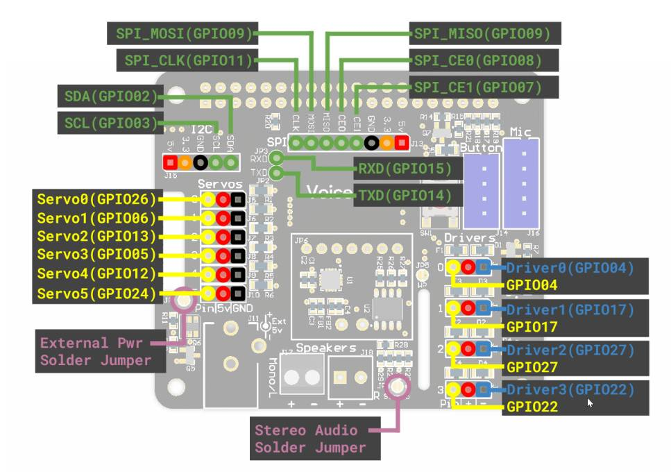
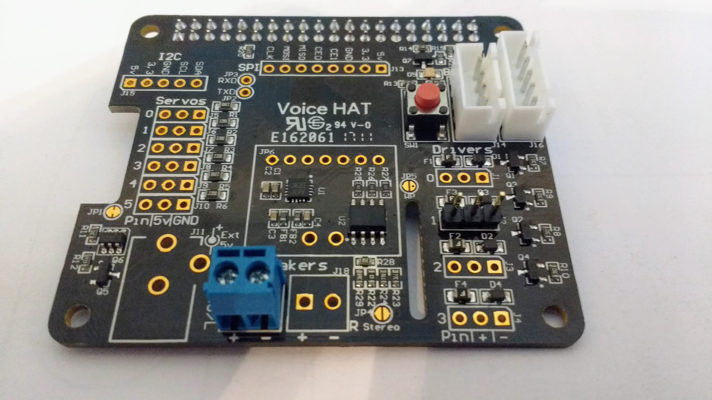
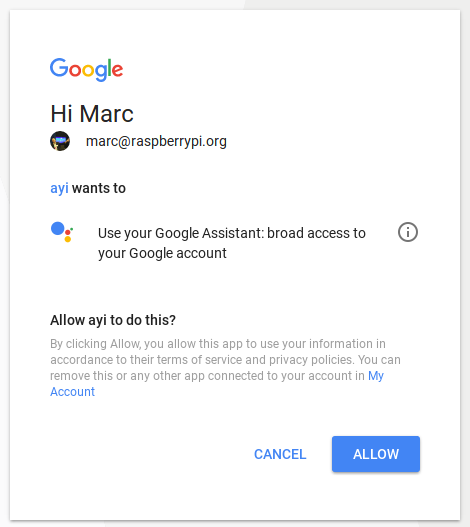

## Controlling the World with Google AIY

The Google AIY Voice Kit came free with the May, 2017 issue of the MagPi, so well done if you have managed to aquire one. If you haven't yet managed to get a Voice Kit, then you can join a waiting list to receive a notification when they are available by signing up [here](https://docs.google.com/forms/d/e/1FAIpQLSev7IQBFUaDlv5tx1Decxd5Ya5AqYSEvD72hJySeaRDogaqAw/viewform?c=0&w=1)

--- step ---
## Solder on header pins

In this project you're going to use the Voice Kit to make an LED blink with a voice command. If you can blink an LED then there really are very few limits on what you can control.

The first thing to do is to set up the Voice Kit HAT. As you will be blinking an LED, you will need to use some soldered header pins to allow you to access the GPIO pins of the Raspberry Pi

You can solder a set of three header pins to the holes on the board that are in the column of **Drivers**. In particular, you want row **1**.

You can see the mapping of all the GPIO pins on the following schematic, in case you want to use different GPIO pin.



And here is a photograh showing the three soldered header pins.



If you have never soldered before, and need some help, then have a look at our [Getting Started With Soldering](https://www.raspberrypi.org/learning/getting-started-with-soldering/) resource.

--- /step ---

--- step ---
## Setting up the hardware

You can follow the [build guide on the Google AIY website](https://aiyprojects.withgoogle.com/voice/#assembly-guide-4-put-it-all-together) if you want. However, it uses the carboard box to house the kit, and this will restrict access to the GPIO pins. If you want to follow a simplere guide then you can use the instructions below.

--- collapse ---
[[[rpi-aiy-voice-assemble]]] 
--- /collapse ---
--- /step ---

--- step --- 
## Install the Software

If you like, you can install the software for the Voice Kit manually. Google have [this guide](https://aiyprojects.withgoogle.com/voice/#makers-guide) to take you through the process. It is far easier, however, to use their image on an SD card.

You can download [their image here](https://dl.google.com/dl/aiyprojects/voice/aiyprojects-latest.img.xz), and if you want guidance on how to burn an image to an SD card then have a look at our [guide here](https://www.raspberrypi.org/learning/software-guide/quickstart/)

The Google image comes as `.xz` file. To extart this on Linux you can install `unxz`.

``` bash
sudo apt update && sudo apt install unxz -y
unxz aiyprojects-2017-05-03.img.xz
```

On Windows or MacOS **Etcher** should handle this for you.

Then just insert your SD card and boot your Raspberry Pi.
--- /step ---

--- step ---
Once your Raspberry Pi has booted, you're going to need some credentials from Google, for this to work. Follow the steps below to enable the Google Assistant API.

--- collapse
[[[generic-api-google-assistant]]]
--- /collapse ---

Your secrets file that you downloaded will be called something like `client_secret_89351974213-jsno1i2s7lu9mv4q9bjbf3pas6cpnbe5.apps.googleusercontent.com.json`. This needs renaming and placing in your `/home/pi` directory. The new name should be `assistant.json`.

--- step ---

## Test it's working ##

With the hardware and software all set up, you need to test that your Voice Kit is working.

- Click on the **Start dev terminal** icon on the desktop, to open a terminal.


- To start the program manually you can simply type `src/main.py` into the *Terminal**

- If this is the first time you have run the program, **Chromium** will open and ask you to login and authorise the use of the Google API.



- Click **ALLOW** to enable access to the API. Now you should be able to use the button to begin capturing your voice commands. There are several built in instructions that you can use. Try saying any of the following after pushing the button:
  - *"What are the three laws of robotics"*
  - *"What is the time?"*
  - *"IP Address"*

- You can also ask it questions that will result in a simple Google search
  - *"Who is the Prime Minister"*
  - *"What is the air-speed velocity of an unladen swallow"*
  
- Have a good play with the device before learning how to hack it to create your own voice commands.
--- /step ---

--- step ---
## Simple voice responses

The AIY Voice kit software allows you to add your own simple voice commands that will provide simple responses.

- Using a text editor or IDLE, openthe file called `action.py`. You can find it at `/home/pi/voice-recognizer-raspi/action.py`.

- Most of this file contains instructions on how to use it, but if you scroll past the first set of comments, you should see the following code:

``` python
class SpeakAction(object):

    """Says the given text via TTS."""

    def __init__(self, say, words):
        self.say = say
        self.words = words

    def run(self, voice_command):
        self.say(self.words)
```
- This `class` does a few simple things. Don't worry if you're not too familiar with classes, as understanding what it does is more important.
  - The class starts by initialising (`__init__`) an object with two things. `self.say` is a special function defined in another file. This function handles all the complicated conversion of text to speech.
    - The class also initiialises an object with `self.words`. This is again a sting, and represents what you want the Voice Kit to respond through the speaker. If `self.words` was the string `"I'm fine, thank you"`, then that is what the Voice Kit would respond.
  - The class has a `run` method. This has a `voice_command` parameter. The `voice_command` are all the words that you speak into the microphone.
  - In the run function are the actions that you need to be performed. In this case the `self.say(self.words` will just convert a string to speach for output through the speaker.
  
- To use this class, scroll down the code and have a look at the section where it says the following:

``` python
    # =========================================
    # Makers! Add your own voice commands here.
    # =========================================
```

- Here's where you can add some simple voice commands and their associated responses. Underneath the comment, you can now add your own action. Try adding the following lines and make sure that you keep the indentation.

``` python
    # =========================================
    # Makers! Add your own voice commands here.
    # =========================================
	actor.add_keyword(_("what's up"), SpeakAction(say, "I'm fine, thank you"))
```

- So what does this line do? `actor.add_keyword(_("what's up")` instructs the code to listen out for the keywords *"what's up"* to be spoken. When the keywords are recognised then the code within the `SpeakAction` class is run. What is passed in is the command the user spoke (`say`) and the string `"I'm fine, thank you"`. The `SpeakAction` code that you looked at earlier then outputs that tring through the microphone.

- Have a go at running this code, and test that it's working.

- Now try adding your own set of keywords and responses underneath the one you have just written.

--- /step ---

## Making your own actions

- An action is the thing that you want your voice kit to do. Below is about the most basic action you can come up with.

```python
class PrintHelloWorld():
	"Prints Hello World!"

	def run(self, voice_command):
	    print("Hello World!")
```

- All this will do is print `Hello World!` to the console when you run the program. If you add the following voice command in, you can test this out.

```python
    actor.add_keyword(_("hello world"), PrintHelloWorld())
```

- Have a play around with this an see what else you can get the voice kit to do.

--- step ---
## Controlling an LED

Now is your chance to try and make an LED turn on an off when an command is given. Alter the code so that when the command "LED" is spoken, the LED turns on, stays on for 5 seconds, then switches off.

--- hints ---

--- hint ---
1. Wire up an LED and a resistor to the header pins you soldered on.
2. Somewhere near the top of the file, you will need to import the `LED` class from the `gpiozero` module. You'll also want the `sleep` function from the `time` module.
3. You will want to create an `led` object on pin 17.
4. When the command to turn on the led is given, the `led.on()` method should be called, there should be a pause for a few seconds, then the `led.off()` method should be called.
--- /hint ---

--- hint ---

--- /hint ---

--- hint
TODO - ADD IN SCREEN CAST MAKING THE FUNCTION
--- /hint ---
