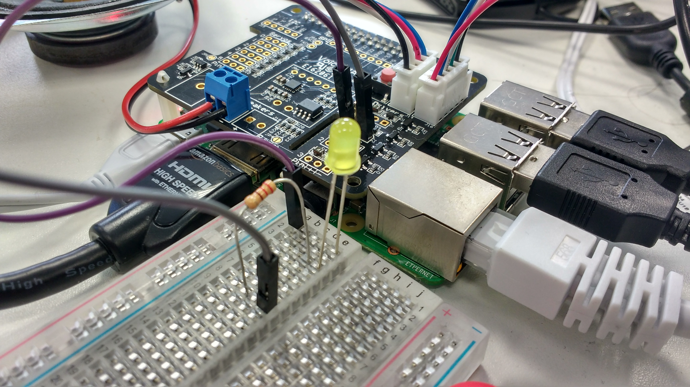

## Controlling an LED

Now is your chance to try and make an LED turn on and off again when a command is given.

- Firstly, connect an LED to the header pins you soldered on earlier.



- The positive (long) leg of the LED should be connected to the middle pin, and the negative leg (short leg) should be connected to the pin on the right of it.

- You'll now need to do the following in the `action.py` file.
    1. Near the top of the file import the `LED` class from the `gpiozero` module
	1. Create an `led` object on **GPIO 17**
	1. Create a `ControlLED` class that turns the LED on, waits for 5 seconds, and turns the LED off again
	1. Create a new voice command to trigger the class when the letters "LED" are spoken
	
- Have a look at the hints below if you're not sure how to proceed.

--- hints --- --- hint ---
- Import the `LED` class and the `sleep` function near the top of the file, where the other imports are
- Underneath this set up the `led` object:
  ```python
  led = LED(17)
  ```
- You can use the following code inside a `run` method to make the LED come on and off again:
	```python
	led.on()
	sleep(5)
	led.off()
	```
--- /hint --- --- hint ---
- Your voice command should look like this:
	```python
	actor.add_keyword("LED", ControlLED())
	```
- And here's what your class should look like:
	```python
	class ControlLED():

		def run(self, voice_command):
			led.on()
			sleep(5)
			led.off()
	```
--- /hint --- --- hint ---
<iframe width="560" height="315" src="https://www.youtube.com/embed/fnWZlFZHIJY" frameborder="0" allowfullscreen></iframe>
--- /hint ---
--- /hints ---
