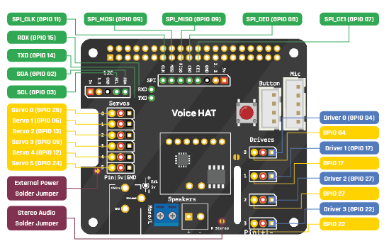

## Solder on header pins

In this project, you're going to use the Voice Kit to make an LED blink in response to a voice command. If you can make an LED, then there really are very few limits to what you can control.

The first thing to do is to set up the Voice HAT. As you will be controlling an LED, you will need to use some soldered header pins to allow you to access the GPIO pins of the Raspberry Pi

You can solder a set of three header pins to the holes on the board that are in the column of **Drivers**. In particular, you want row **1**.

You can see the mapping of all the GPIO pins on the following schematic, in case you want to use a different GPIO pin.

And here is a photograph showing the three soldered header pins:

If you have never soldered before, and need some help, then have a look at our [Getting Started With Soldering](https://www.raspberrypi.org/learning/getting-started-with-soldering/){:target="_blank"} guide, or watch the video below.

--- collapse ---
---
title: Getting Started With Soldering
---
<iframe width="560" height="315" src="https://www.youtube.com/embed/8Z-2wPWGnqE" frameborder="0" allowfullscreen></iframe>
--- /collapse ---

