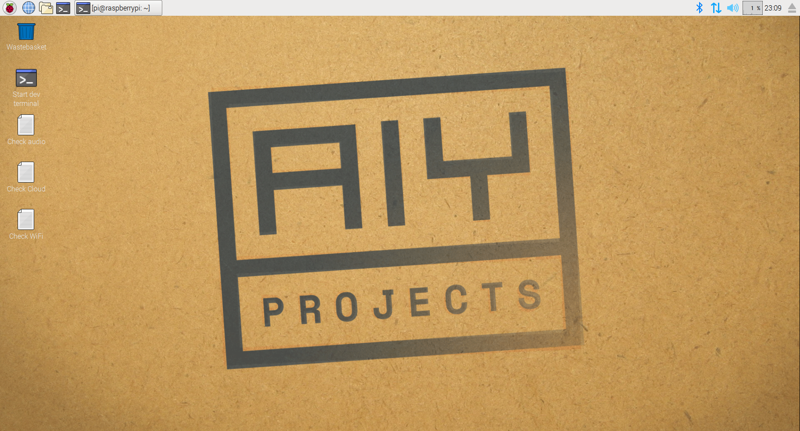

## Install the Software

If you like, you can install the software for the Voice Kit manually. Google provides [this guide](https://aiyprojects.withgoogle.com/voice/#makers-guide){:target="_blank"} to take you through the process. It is far easier, however, to use their image on an SD card.

You can download their image [here](https://dl.google.com/dl/aiyprojects/voice/aiyprojects-latest.img.xz), and if you want guidance on how to burn an image to an SD card, have a look at our guide [here](https://www.raspberrypi.org/learning/software-guide/quickstart/){:target="_blank"}.

The Google image comes as an `.xz` file. To extract this on Linux, you can install `unxz`.

``` bash
sudo apt update && sudo apt install zx-utils -y
unxz aiyprojects-2017-05-03.img.xz
```

On Windows or MacOS, [**Etcher**](https://etcher.io/){:target="_blank"} should handle this for you.

Then just insert your SD card and boot your Raspberry Pi. Your button should be slowly pulsing and your desktop should look like this:


