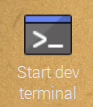

## Test it's working

With the hardware and software all set up, you need to test that your Voice Kit is working.

- Click on the **Start dev terminal** icon on the desktop, to open a terminal.

	

- To start the program manually you can simply type `src/main.py` into the *Terminal**

- If this is the first time you have run the program, **Chromium** will open and ask you to login and authorise the use of the Google API.

	

- Click **ALLOW** to enable access to the API. Now you should be able to use the button to begin capturing your voice commands. There are several built in instructions that you can use. Try saying any of the following after pushing the button:
  - *"What are the three laws of robotics"*
  - *"What is the time?"*
  - *"IP Address"*

- You can also ask it questions that will result in a simple Google search
  - *"Who is the Prime Minister"*
  - *"What is the air-speed velocity of an unladen swallow"*
  
- Have a good play with the device before learning how to hack it to create your own voice commands.
